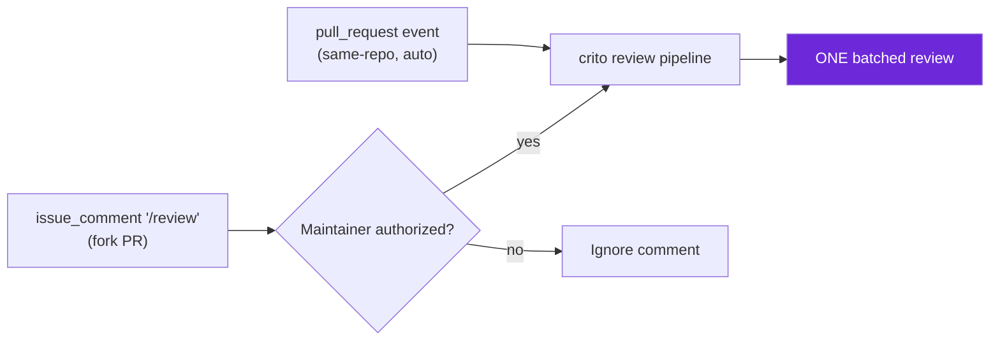
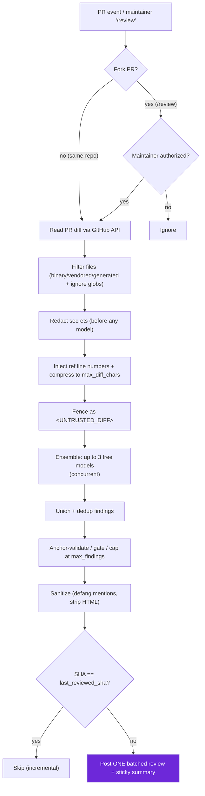
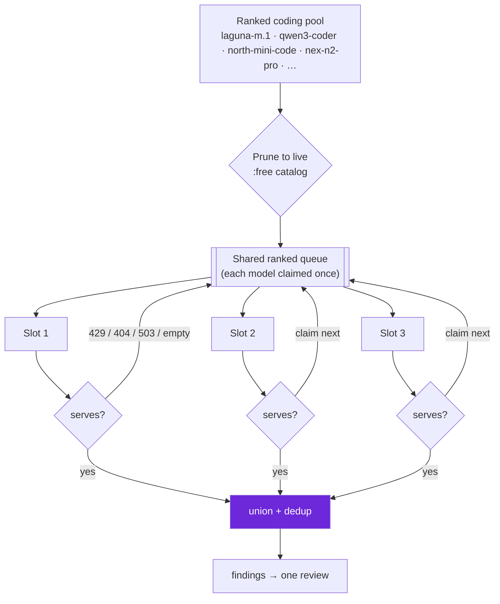

<p align="center">
  
</p>

<p align="center">
  <b>AI code review that runs in your CI on every PR — free models, your key, zero infra.</b>
</p>

<p align="center">
  <a href="LICENSE"></a>
  <a href="https://www.python.org/"></a>
  <a href="action.yml"></a>
  <a href="#-contributing"></a>
</p>

<p align="center">
  <a href="#-quick-start">Quick start</a> ·
  <a href="#%EF%B8%8F-how-it-works">How it works</a> ·
  <a href="#%EF%B8%8F-configuration">Configuration</a> ·
  <a href="#-models">Models</a> ·
  <a href="#-security">Security</a> ·
  <a href="docs/architecture.md">Docs</a>
</p>

---

`crito` is a GitHub Action that reads a pull request's diff through the GitHub API, sends it to free [OpenRouter](https://openrouter.ai/) models, and posts **one batched review** — inline comments anchored to changed lines plus a single sticky summary. It is **pure read-and-comment**: it never checks out, builds, merges, or executes PR code, and it never writes to your repo. Bring your own OpenRouter key (BYOK); there is no server, no database, nothing to host.

> [!TIP]
> Hosted reviewers (CodeRabbit, Qodo, Graphite) bill **per seat per month**. `crito` runs inside GitHub Actions on **free** models with **your** key, so the marginal cost of a review is essentially zero. You trade a managed dashboard for a ~30-line workflow file and full control over which models see your diff.

## ✨ Highlights

- 🎯 **Ensemble of up to 3 models** — one prompt fans out concurrently; findings are unioned and deduped (file + category + overlapping line range) for better recall.
- 💬 **One batched review** — a single `COMMENT`-event review (never approve / request-changes), with per-comment fallback if the atomic post is rejected.
- 📌 **Inline comments + sticky summary** — findings anchored to new-side lines in *Files changed*; one summary in *Conversation* with severity counts and models used.
- ⏭️ **Incremental review** — the summary stores a hidden `last_reviewed_sha`, so re-runs skip already-reviewed commits.
- 🔒 **Secret redaction before any model** — gitleaks-style regex scrubs secrets to `[REDACTED_SECRET]` and raises a `critical` finding.
- 🛡️ **Prompt-injection defense** — the untrusted diff is fenced in `<UNTRUSTED_DIFF>`; model output is sanitized (defanged mentions, stripped HTML) before posting.
- 📝 **Natural-language custom rules** — drop repo rules in `.crito/rules.md`, injected as *trusted* instructions outside the fence.
- 🍴 **Fork-safe `/review`** — fork PRs reviewed on demand via a maintainer-gated comment (`author_association` + collaborator authz).
- 🪶 **Zero infra** — two runtime deps (`httpx`, `pyyaml`), Python 3.11, nothing to host.

## 📚 Table of contents

- [Example output](#-example-output)
- [Quick start](#-quick-start)
- [Fork PRs & the `/review` command](#-fork-prs--the-review-command)
- [How it works](#%EF%B8%8F-how-it-works)
- [Configuration](#%EF%B8%8F-configuration)
- [Models](#-models)
- [How crito compares](#-how-crito-compares)
- [Security](#-security)
- [Cost & limits](#-cost--limits)
- [Privacy](#-privacy)
- [Local development](#-local-development)
- [Roadmap](#-roadmap)
- [Contributing](#-contributing)
- [License](#-license)

## 🔬 Example output

A live run on a file with planted bugs produced these inline comments in **Files changed**:

````text
**[critical · security]** SQL query is built with string interpolation, allowing SQL injection.
Use a parameterized query instead.

```suggestion
cursor.execute("SELECT * FROM users WHERE id = ?", (user_id,))
```

**[critical · security]** User input is passed to os.system, enabling command injection.

**[major · bug]** The sqlite connection is never closed — resource leak. Use a context manager.

**[major · correctness]** Mutable default argument `items=[]` is shared across calls.
````

…and **one** sticky summary in **Conversation**:

```text
Reviewed the diff and found 5 issue(s): 2 critical, 3 major.

Models: openai/gpt-oss-120b:free, google/gemma-4-31b-it:free, nvidia/nemotron-3-super-120b-a12b:free
```

## 🚀 Quick start

Zero-config: with no `.crito.yaml`, `crito` ships strong, live-verified defaults and reviews every non-draft PR automatically.

### 1. Add the workflow

Create `.github/workflows/pr-review.yml`:

```yaml
name: PR Review

on:
  pull_request:
    types: [opened, synchronize, reopened, ready_for_review]

permissions:
  contents: read        # read the PR diff
  pull-requests: write  # post the review + summary

concurrency:
  group: pr-review-${{ github.event.pull_request.number }}
  cancel-in-progress: true

jobs:
  review:
    name: Review diff
    runs-on: ubuntu-latest
    if: ${{ github.event.pull_request.draft == false }}  # skip drafts
    steps:
      - name: Checkout action
        uses: actions/checkout@v6

      - name: Run crito
        uses: nitingupta220/crito@v1
        with:
          openrouter_api_key: ${{ secrets.OPENROUTER_API_KEY }}
          github_token: ${{ secrets.GITHUB_TOKEN }}  # automatic, no setup
```

> [!IMPORTANT]
> The job needs `permissions: contents: read` **and** `pull-requests: write`. Without `pull-requests: write`, `crito` can read the diff but cannot post the review.

### 2. Add your OpenRouter key as a repo secret

Get a key at [openrouter.ai/keys](https://openrouter.ai/keys), then go to **Settings → Secrets and variables → Actions → New repository secret**:

- **Name:** `OPENROUTER_API_KEY`
- **Value:** your OpenRouter key

`github_token` is the automatic `secrets.GITHUB_TOKEN` — you do **not** create it.

### 3. Open a PR

Open or push to a pull request on the same repo. The action runs automatically (drafts are skipped) and posts its review when it finishes.

## 🍴 Fork PRs & the `/review` command

For security, the auto-review workflow uses the `pull_request` trigger, which gives fork PRs a **read-only** token and **no** `OPENROUTER_API_KEY` — so fork PRs are never auto-reviewed. Instead a maintainer comments **`/review`** on the PR. The `issue_comment` event runs from the default branch with the base repo's secrets, and `crito` enforces commenter authorization (`author_association` + collaborator permission) so a random fork author can't drain your quota. Fork code is still **never** checked out or executed — only the diff is read via the API.



Add a second workflow, `.github/workflows/pr-review-command.yml`:

```yaml
name: PR Review Command

on:
  issue_comment:
    types: [created]

permissions:
  contents: read
  pull-requests: write

concurrency:
  group: pr-review-cmd-${{ github.event.issue.number }}
  cancel-in-progress: true

jobs:
  review:
    name: Review on /review command
    runs-on: ubuntu-latest
    if: >-
      ${{ github.event.issue.pull_request &&
          startsWith(github.event.comment.body, '/review') }}
    steps:
      - name: Checkout action
        uses: actions/checkout@v6

      - name: Run crito
        uses: nitingupta220/crito@v1
        with:
          openrouter_api_key: ${{ secrets.OPENROUTER_API_KEY }}
          github_token: ${{ secrets.GITHUB_TOKEN }}
```

> [!WARNING]
> `crito` uses `pull_request`, **never** `pull_request_target` — that avoids the classic "pwn-request" privilege-escalation hole. Don't swap the trigger to `pull_request_target` to auto-review forks; use the maintainer-gated `/review` path instead.

## ⚙️ How it works

A staged, read-only pipeline. Secrets are passed to the agent process only — never logged. Full detail in [docs/architecture.md](docs/architecture.md).



The request/response flow between actors:

```mermaid
%% crito request / response flow (BYOK)
sequenceDiagram
    autonumber
    participant Dev as "Developer"
    participant GH as "GitHub"
    participant CR as "crito (Action runner)"
    participant OR as "OpenRouter (x3 models)"
    Dev->>GH: Open PR / comment /review
    GH->>CR: Trigger with openrouter_api_key + github_token
    CR->>GH: Read diff (GitHub API)
    CR->>CR: Filter, redact secrets, compress, fence diff
    CR->>OR: Send &lt;UNTRUSTED_DIFF&gt; to up to 3 free models
    OR-->>CR: Per-model findings
    CR->>CR: Union + dedup, validate, gate, cap, sanitize
    alt New commits since last_reviewed_sha
        CR->>GH: Post ONE batched review + sticky summary
    else Already reviewed
        CR-->>GH: Skip (no new findings)
    end
```

## 🛠️ Configuration

All configuration is **optional**. Place a `.crito.yaml` at your repo root. Precedence is **dataclass defaults → `.crito.yaml` → environment override**. A fully commented sample lives at [`.crito.yaml`](.crito.yaml).

| Key | Type | Default | Meaning |
| --- | --- | --- | --- |
| `models` | list / comma-string | live default chain (see [Models](#-models)) | OpenRouter model ids to ensemble. Capped to 3. Overridden by `OPENROUTER_MODELS` env / `openrouter_models` input. |
| `profile` | string | `chill` | Strictness directive: `chill` (only material issues), `assertive` (more willing to push on design), `strict` (everything, incl. style nits). |
| `ignore` | list / comma-string of globs | `[]` | Globs that **extend** the built-in skip list (lockfiles, minified/bundled output, vendored/generated trees, binaries). Matched files are dropped before prompting. |
| `max_diff_chars` | int | `60000` | Compression budget — the combined diff is packed under this many characters before prompting. |
| `max_files` | int | `60` | Hard cap on changed files reviewed per run. |
| `max_findings` | int | `30` | Hard cap on findings posted (after union + dedupe). |
| `privacy_mode` | string | `zdr` | ⚠️ **Roadmap — accepted but not yet wired.** Does not currently send ZDR provider routing. See [Privacy](#-privacy). |

> [!NOTE]
> **Severities:** `critical` / `major` / `minor` / `nit`. **Categories:** `correctness` / `bug` / `security` / `style` / `design`.

<details>
<summary><b>📄 Annotated <code>.crito.yaml</code> sample</b></summary>

```yaml
# .crito.yaml — every key is honored by crito/config.py::load_config.
# Precedence (lowest wins to highest):
#   1. dataclass defaults  2. this file  3. OPENROUTER_MODELS env (models only)

# A list (or comma-string) of OpenRouter model ids, capped to 3. The same
# prompt fans out concurrently and findings are unioned + deduped. Left
# commented to use the live default chain; uncomment to pin your own.
# models:
#   - openai/gpt-oss-120b:free
#   - nvidia/nemotron-3-super-120b-a12b:free
#   - google/gemma-4-31b-it:free

# chill | assertive | strict  (default: chill)
profile: chill

# Globs that EXTEND the built-in skip list. Keep minimal — over-ignoring
# hides real changes. Default: [] (only built-in SKIP_PATTERNS apply).
ignore:
  - "**/*.lock"
  - "docs/_build/**"

max_diff_chars: 60000   # compression budget before prompting
max_files: 60           # hard cap on changed files per run
max_findings: 30        # hard cap on findings posted (after dedupe)

# ACCEPTED but NOT YET WIRED — v1 does not send ZDR routing. Roadmap.
# For proprietary code, override `models` with a paid / ZDR-capable provider.
privacy_mode: zdr
```

</details>

**Custom rules.** Put natural-language, repo-specific rules in `.crito/rules.md`. They are injected as **trusted** instructions, kept outside the untrusted-diff fence:

```markdown
- All new HTTP handlers must validate the `Authorization` header.
- Flag any use of `print(` in library code; we use the logging module.
- Database migrations must be reversible.
```

**Environment override.** The `OPENROUTER_MODELS` env var (set by the action's `openrouter_models` input) is a comma-separated list that overrides the `models` key **only** — all other keys still come from `.crito.yaml` / defaults.

See [docs/custom-rules.md](docs/custom-rules.md) for writing effective rules.

## 🤖 Models & auto-routing

crito reviews with a **ranked pool of top free _coding_ models** (`config.CODING_POOL`, live-verified 2026-06-18, best→worst for code review):

```text
poolside/laguna-m.1:free            # flagship agentic coder, 72.5% SWE-bench Verified
qwen/qwen3-coder:free               # proven #1 free coder, 1M ctx (often 429 → skipped)
cohere/north-mini-code:free         # Cohere code-specialist + reasoning
nex-agi/nex-n2-pro:free             # Qwen3.5-lineage agentic MoE, best JSON support
poolside/laguna-xs.2:free           # 2nd Poolside coder, 68.2% SWE-bench
openai/gpt-oss-120b:free            # most JSON-clean free model; reliability floor
… + nemotron-ultra/super, gemma, qwen3-next, gpt-oss-20b   # diversity / deep failover
```

### 🔀 Per-slot auto-routing (failover)

The ensemble runs **3 concurrent "slots"**, each filled from the **top of the pool**. If a slot's model is **unavailable** — rate-limited (`429`), retired (`404`), down (`503`), or returns empty — that slot **automatically advances down the ranked pool to the next available top coding model**, independently. A shared lock-guarded queue hands each model to **at most one slot**, so no two slots collide and total model calls are bounded by the pool size. A slot only contributes nothing when the **whole pool** is exhausted.



> [!NOTE]
> Live example: `qwen/qwen3-coder` is frequently `429`-saturated upstream — its slot transparently fails over to the next serving coder (e.g. `nex-n2-pro`), and `qwen3-coder` self-heals back into rotation the moment it frees up. Key-level errors (`401`/`402`) abort instead of advancing — switching models can't fix a dead key.

**Failure → action:** `429`/`503` retried with backoff then advance · `404` pruned for the run · empty/truncated advance · `401`/`402` fatal (abort).

**Override** three ways, highest precedence last: the `models:` key in `.crito.yaml`, the `openrouter_models:` action input, or the `OPENROUTER_MODELS` env var (each capped to 3 active slots) — your picks become the leading slots and failover still draws from the full coding pool tail.

> [!WARNING]
> **The `:free` roster churns** — Kimi/GLM/DeepSeek lost their `:free` slugs in 2026. crito prunes retired slugs against the **live catalog** at startup, so a dead model never wastes a slot. Treat model IDs as runtime config. See [docs/model-strategy.md](docs/model-strategy.md).

## 📊 How crito compares

|  | **crito** | CodeRabbit | Qodo | Graphite |
| --- | --- | --- | --- | --- |
| Pricing | Free models, your key | Per seat / month | Per seat / month | Per seat / month |
| Key / BYOK | ✅ BYOK (OpenRouter) | Hosted keys | Hosted keys | Hosted keys |
| Infra to run | None (GitHub Actions) | Hosted SaaS | Hosted SaaS | Hosted SaaS |
| Source | ✅ Open source (GPL-3.0) | Proprietary | Proprietary | Proprietary |
| Runs in your CI | ✅ Yes | App / integration | App / integration | App / integration |
| Model choice | ✅ You pick the models | Vendor-managed | Vendor-managed | Vendor-managed |

`crito` trades a managed dashboard, deep code-graph context, and dedicated support for **zero cost, zero infra, and full control** over which models see your code. If you want a hosted product with a UI and SLAs, the others are a better fit; if you want a lean Action you own end to end, that's `crito`.

## 🔐 Security

- **Pure read → comment** — zero write/merge/exec; only reads the diff and posts comments.
- **`pull_request`, never `pull_request_target`** — avoids the classic pwn-request escalation hole; fork code is never checked out or executed.
- **Untrusted-diff fencing** — the diff is wrapped in `<UNTRUSTED_DIFF>` so PR content can't hijack model instructions.
- **Output sanitization** — model output is defanged (`@`-mentions neutralized, HTML stripped) before posting.
- **Pre-model secret redaction** — gitleaks-style regex redacts secrets to `[REDACTED_SECRET]` before prompting, and flags a `critical` finding.
- **Key custody** — your OpenRouter key lives in your repo secret; never custodied by us, never logged, never placed in the prompt.
- **`/review` authz** — the comment trigger is gated on `author_association` + collaborator permission so forks can't drain your quota.

<details>
<summary><b>More on the threat model & ops</b></summary>

The whole design assumes the diff is **untrusted input**. Secrets are redacted before any bytes reach a model, the diff is fenced so injected instructions are treated as data, and model output is sanitized before it touches GitHub. The token only needs `contents:read` + `pull-requests:write`, and fork PRs get no secrets at all under `pull_request`. Full detail in [docs/security-and-ops.md](docs/security-and-ops.md).

</details>

## 💸 Cost & limits

`crito` runs on **your** OpenRouter key against **free** models, so reviews are effectively free. The honest constraints:

- **Free-tier rate limits:** roughly **20 req/min** and **~50 req/day**, until a one-time **~$10** OpenRouter credit raises the daily cap to **~1000/day**.
- **Per-PR cost:** the ensemble uses **up to 3 LLM calls per PR** (one per model).
- **Real binding constraint:** **upstream provider saturation** of free models (429s). The model fallback chain mitigates this — if one free slug is saturated, override to a serving one.

See [docs/spike-openrouter-quota.md](docs/spike-openrouter-quota.md) for the measured numbers.

## 🔏 Privacy

> [!WARNING]
> Be deliberate about what you send to free models. Most OpenRouter **`:free`** models route to providers only if your account permits **training on prompt data** — so free-model review may expose your diff to providers for training. **v1 does not yet enforce zero-data-retention (ZDR) routing**; the `privacy_mode` key is accepted but not wired.

**For proprietary code:** override the `models` key with a paid / ZDR-capable provider (or your own BYOK provider slug) instead of relying on the free chain or `privacy_mode`. ZDR routing is on the [roadmap](#-roadmap).

## 🧪 Local development

The agent is mostly stdlib; only `openrouter.py` and `github_client.py` import `httpx` directly. The smoke test exercises only the stdlib-only transform modules — it never imports `review.py` — so it runs with **no dependencies and no network**.

```bash
git clone https://github.com/nitingupta220/crito.git
cd crito

# Stdlib-only smoke test — 11 checks, no deps, no network:
python tests/test_smoke.py

# Byte-compile everything:
python -m py_compile crito/*.py
```

**Runtime dependencies (just two):** `httpx` and `pyyaml` (see `requirements.txt`).

<details>
<summary><b>Module layout (<code>crito/</code>)</b></summary>

| Module | Responsibility |
| --- | --- |
| `review.py` | Orchestrator — the staged pipeline end to end |
| `diff.py` | File filtering + diff rendering with reference line numbers |
| `config.py` | Loads `.crito.yaml`, env override, custom rules |
| `secrets_scan.py` | Pre-model gitleaks-style secret redaction |
| `prompts.py` | Builds the system/user prompt, profile directive, fence |
| `schema.py` | Findings schema + enums + normalization |
| `ensemble.py` | Union + dedupe of multi-model findings |
| `openrouter.py` | OpenRouter chat-completions client (`httpx`) |
| `github_client.py` | GitHub REST client — read diff, post review (`httpx`) |
| `postprocess.py` | Anchor validation, capping, ordering |
| `sanitize.py` | Defang mentions / strip HTML from model output |
| `authz.py` | `/review` commenter authorization |

</details>

For design rationale and the constraints to respect before contributing, see [docs/decisions.md](docs/decisions.md) and [CONTRIBUTING.md](CONTRIBUTING.md).

## 🗺️ Roadmap

Deliberately deferred for after v1:

- **ZDR routing** — wire `privacy_mode` to send zero-data-retention provider routing.
- **Hybrid linters** — fold in `semgrep` / `ruff` signal alongside the LLM ensemble.
- **Learnings / memory** — persist accepted/dismissed feedback to tune future reviews.
- **Managed SaaS** — an optional hosted offering for teams that don't want BYOK.
- **More forges** — GitLab and Bitbucket support.
- **More commands** — `/describe` (PR summaries) and `/ask` (Q&A on the diff).

## 🤝 Contributing

Contributions are welcome — open an issue or PR. Please read [CONTRIBUTING.md](CONTRIBUTING.md) and [docs/decisions.md](docs/decisions.md) for the design rationale and constraints to respect (stdlib-first, zero-infra, read-only) before sending changes.

## 📄 License

Licensed under the **GNU General Public License v3.0**. See [LICENSE](LICENSE).

---

```text
  ___
 /   \   .
|  C  )  o    crito
 \___/        a sharp critique on every PR
```

<p align="center"><sub>Built for developers who want a sharp second eye on every PR — and nothing to host.</sub></p>
